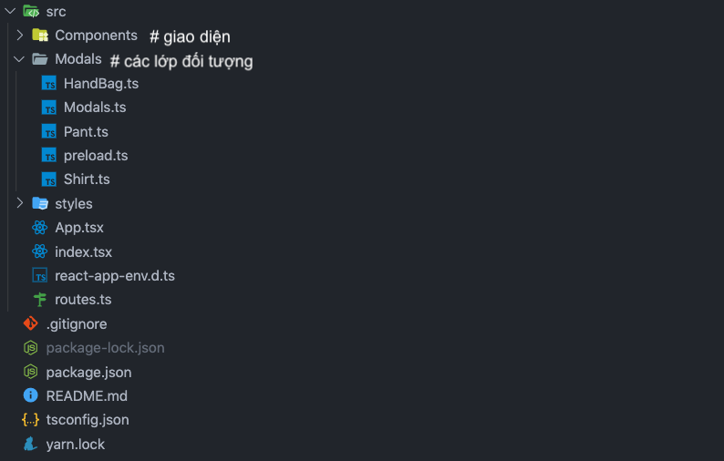

# Bài tập lớn lập trình hướng đối tượng

## Nhóm 8 
#### Thành viên: Hoàng Minh Tân 20194367,...
## Bài toán: Quản lý cửa hàng thời trang.
**Quản lý cửa hàng thời trang**: Một cửa hàng bán các sản phẩm thời trang gồm các loại: áo, quần, túi xách. Tùy sản phẩm, kích thước sản phẩm gồm các thông số khác nhau. ví dụ với áo: dài áo, rộng áo, dài tay, rộng tay. với quần: dài quần, bụng, rộng ống. với túi: dài túi, rộng túi. Xây dựng hệ thống quản lý sản phẩm trong cửa hàng gồm các chức năng:
1. Thêm, Bớt, Sửa, Xóa một sản phẩm
2. Tìm kiếm sản phẩm theo tên sản phẩm, mã, màu sắc, nhãn hiệu. 
3. Tìm kiếm tất cả các sản phẩm được bán trong tháng hiện tại cùng thông tin về kích thước sản phẩm.
4. Thống kê danh sách 10 sản phẩm bán chạy nhất trong khoảng thời gian nhập vào.
##  Giải pháp hướng đối tượng
### 1. Ngôn ngữ lập trình: _Typescript_ [docs](https://www.typescriptlang.org/docs/)
###  2. Các thư viện sử dụng: _React.js_ [docs](https://reactjs.org/)
### 3. Cấu trúc thư mục

